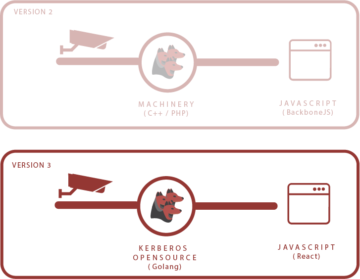

# Kerberos Open Source

[**Docker Hub**](https://hub.docker.com/r/kerberos/opensource) | [**Documentation**](https://doc.kerberos.io)

Kerberos Open source (v3) is a cutting edge video surveillance management system made available as Open source (Apache 2.0) with a Commons Clause License on top. This means that all the source code is available for you or your company, and you can use and transform it as long it is for non commercial usage. Read more about the license at the bottom of this page.

## Previous releases

This repository contains the next generation of Kerberos.io, **Kerberos Open Source (v3)**, and is the successor of the machinery and web repositories. A switch in technologies and architecture has been made.

This version is still under active development and can be followed on the [develop branch](https://github.com/kerberos-io/opensource/tree/develop) and [project overview](https://github.com/kerberos-io/opensource/projects/1).

## Introduction

Kerberos.io is a cutting edge video surveillance system with a strong focus on user experience, scalability, resilience, extension and integration. Kerberos.io provides different solutions, but from a high level point of view it comes into two flavours: Kerberos Open Source and Kerberos Enterprise. The main differences, very brief, between Open Source and Enterprise are described below. Both Kerberos Open Source and Kerberos Enterprise can be extended and integrated with Kerberos Storage and/or Kerberos Cloud.

### Kerberos Open Source

- Installation in seconds (Kerberos Etcher, Docker, Binaries).
- Simplified and modern user interface.
- Multi architecture (ARMv7, ARMv8, amd64, etc).
- Multi camera support: IP Cameras (MJPEG/H264), USB cameras, Raspberry Pi Cameras.
- Single camera per instance (e.g. One Docker container per camera).
- Cloud integration through Webhooks, MQTT, etc.
- Cloud storage through Kerberos Cloud.
- Non-commercial usage - Commons Clause License (Apache 2.0)

### Kerberos Enterprise

- Installation on top of Kubernetes (K8S).
- Camera support for IP camera only (RTSP/H264).
- Massive horizontal scaling, thanks to Kubernetes.
- Management of multiple Kerberos Agents through a single pane of glass.
- Low memory and CPU intensive.
- Modular and extensible design for building own extensions and integrations (e.g. a video analytics platform).
- Commercial licensed and closed source.

## How it works: A world of Agents 🕵🏼‍♂️

Kerberos.io applies the concept of agents. An agent is running next to or on your camera, and is processing a single camera feed. It applies motion based recording and make those recordings available through a user friendly web interface. Kerberos Open Source allows you to connect to other cloud services or custom applications. Kerberos Open Source is perfect for personal usage and/or is a great tool you only have a couple of surveillance cameras to be managed.

If you are looking for a solution that scales with your video surveillance or video analytics well, [Kerberos Enterprise might be a better fit](https://doc.kerberos.io/enterprise/introduction).

## Installation
Kerberos Open Source comes with different installation flavours (it includes both the machinery and web repository). The reason is because depending on the use case one option is better than another. A short list of recommendations:

- KiOS: You have a Raspberry Pi, and you only want to run a Kerberos agent on it.
- Raspbian: You have a Raspberry Pi, but you want other services running next to the Kerberos agent.
- Docker: You have a lot of IP cameras, and/or don't want to mess with dependencies.
- Generic: You want to develop/extend Kerberos with your own features, or you want to run a Kerberos agent on a not supported OS/architecure.

## Common Clause License

[“Commons Clause” License Condition v1.0](https://commonsclause.com/)

The Software is provided to you by the Licensor under the License, as defined below, subject to the following condition.

Without limiting other conditions in the License, the grant of rights under the License will not include, and the License does not grant to you, the right to Sell the Software.

For purposes of the foregoing, “Sell” means practicing any or all of the rights granted to you under the License to provide to third parties, for a fee or other consideration (including without limitation fees for hosting or consulting/ support services related to the Software), a product or service whose value derives, entirely or substantially, from the functionality of the Software. Any license notice or attribution required by the License must also include this Commons Clause License Condition notice.

Software: Kerberos Open Source

License: Apache 2.0

Licensor: Kerberos.io
