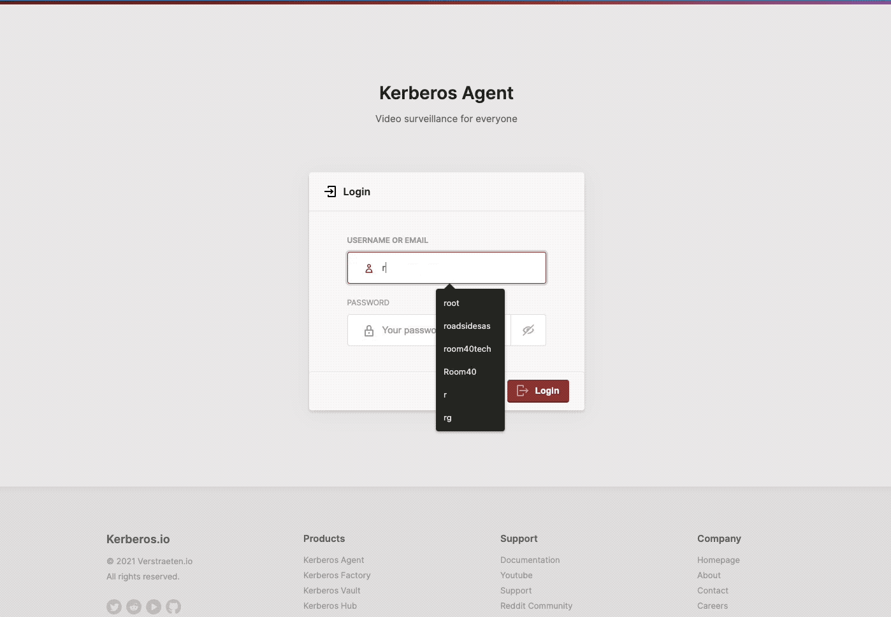
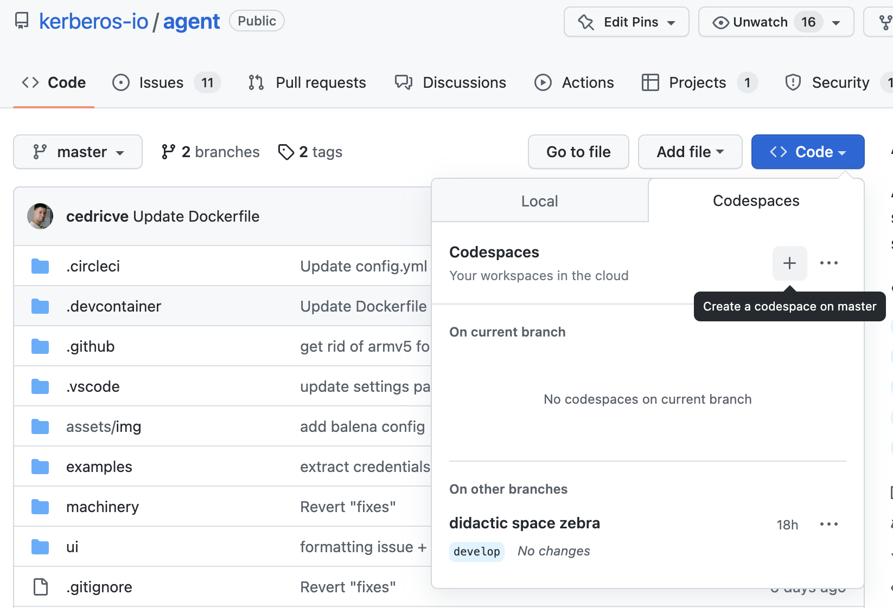
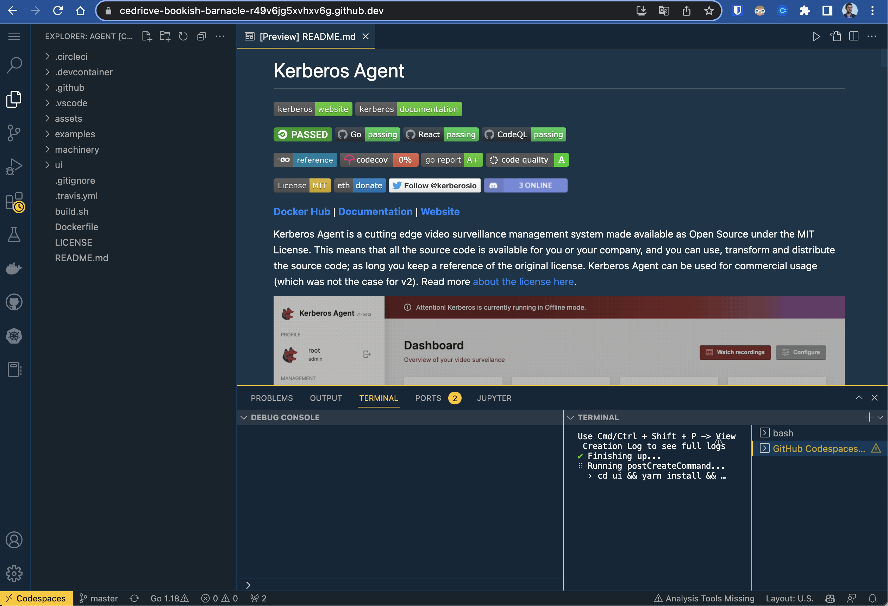
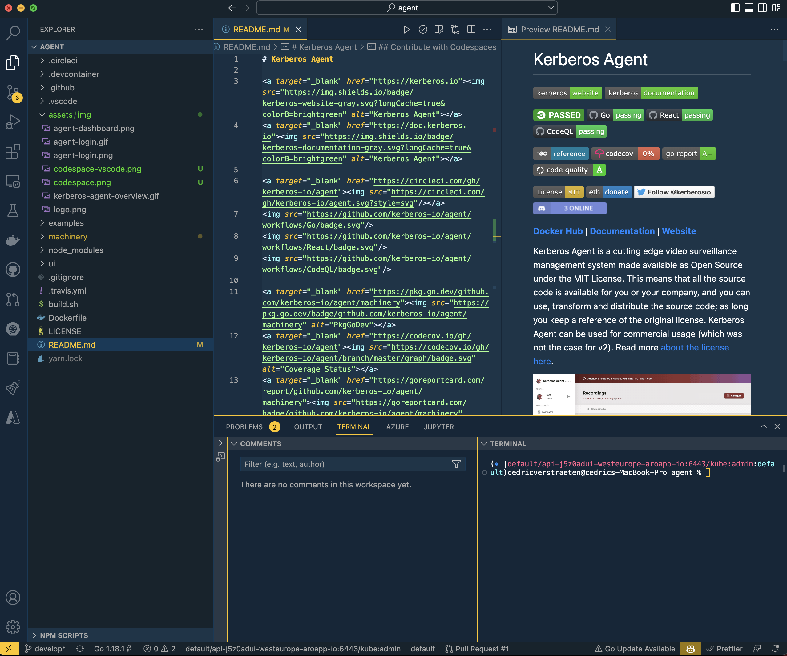

# Kerberos Agent

<a target="_blank" href="https://app.codacy.com/gh/kerberos-io/agent?utm_source=github.com&utm_medium=referral&utm_content=kerberos-io/agent&utm_campaign=Badge_Grade">

[**Docker Hub**](https://hub.docker.com/r/kerberos/agent) | [**Documentation**](https://doc.kerberos.io) | [**Website**](https://kerberos.io)

Kerberos Agent is a cutting edge video surveillance management system made available as Open Source under the MIT License. This means that all the source code is available for you or your company, and you can use, transform and distribute the source code; as long you keep a reference of the original license. Kerberos Agent can be used for commercial usage (which was not the case for v2). Read more [about the license here](LICENSE).

## :thinking: Prerequisites

* An IP camera which supports a RTSP h264 encoded stream,
* (or) a USB camera, Raspberry Pi camera or other camera, that [you can tranform to a valid RTSP stream](https://github.com/kerberos-io/camera-to-rtsp).
* Any hardware that can run a Docker container, for example: a Raspberry Pi, NVidia Jetson, Intel NUC, a VM, Bare metal machine or a full blown Kubernetes cluster.

## :books: Overview

### Up and running in no time
1. [Quickstart - Docker](#quickstart---docker)
2. [Quickstart - Balena](#quickstart---balena)

### Introduction
3. [Introduction](#introduction)
4. [How it works: A world of Agents 🕵🏼‍♂️]()
5. [Running as a container](#running-as-a-container)
   
### Contributing
1. [Contribute with Codespaces](#contribute-with-codespaces)
2. [Develop and build](#develop-and-build)
3. [Building from source](#building-from-source)
4.  [Building for Docker](#building-for-docker)

### Varia
10. [Support our project](#support-our-project)
11. [Previous releases](#previous-releases)
12. [FAQ](#faq)

## Quickstart - Docker

The easiest to get your Kerberos Agent up and running is to use our Docker image on [Docker hub](https://hub.docker.com/r/kerberos/agent). Once you selected a specific tag, run below command, which will open the web interface of your Kerberos agent on port `80`. For persisting your configuration and/or recordings [attach a volume](#attach-a-volume).
    
    docker run -p 80:80 --name mycamera -d kerberos/agent:latest

If you want to connect to an USB or Raspberry Pi camera, [you'll need to run our side car container](https://github.com/kerberos-io/camera-to-rtsp) which proxy the camera to an RTSP stream. 

## Quickstart - Balena

Run Kerberos Agent with Balena super powers. Monitor your agent with seamless remote access, and an encrypted https endpoint. 
Checkout our fleet on [Balena Hub](https://hub.balena.io/fleets?0%5B0%5D%5Bn%5D=any&0%5B0%5D%5Bo%5D=full_text_search&0%5B0%5D%5Bv%5D=agent), and add your agent.

***Work In Progress*** - Currently we only support IP Cameras, we have [an approach for leveraging the USB and Raspberry Pi camera](https://github.com/kerberos-io/camera-to-rtsp), but this isn't working as expected with Balena. If you require this, you'll need to use the traditional Docker deployment with sidecar as mentioned above.

## Introduction

Kerberos.io is a cutting edge video surveillance system with a strong focus on user experience, scalability, resilience, extension and integration. Kerberos.io provides different solutions, but from a high level point of view it comes into two flavours: Kerberos Agent and Kerberos Enterprise Suite. Bottom line Kerberos Enterprise Suite extends Kerberos Agent with additional components such as Kerberos Factory, Kerberos Vault and Kerberos Hub.

### Kerberos Agent

- Low memory and not CPU intensive.
- Installation in seconds (Docker, Balena, etc).
- Simplified and modern user interface.
- Multi architecture (ARMv7, ARMv8, amd64, etc).
- Multi camera support: IP Cameras (MJPEG/H264), USB cameras and Raspberry Pi Cameras [through a RTSP proxy](https://github.com/kerberos-io/camera-to-rtsp).
- Single camera per instance (e.g. One Docker container per camera).
- WIP: Integrations (Webhooks, MQTT, Script, etc).
- Cloud storage (Kerberos Hub, Kerberos Vault). WIP: Minio, Storj, etc.
- Ability to specifiy conditions: motion region, time table, continuous recording, etc.
- MIT License

### Kerberos Factory (part of [Kerberos Enterprise suite](https://doc.kerberos.io/enterprise/first-things-first/))

- Kerberos Agent leveraged in a Kubernetes cluster [through a UI](https://doc.kerberos.io/factory/getting-started/).
- Camera support for IP camera only (RTSP/H264).
- Massive horizontal scaling and flexibility (private, hybrid and cloud deployment).
- Management of multiple Kerberos Agents through a single pane of glass.

## How it works: A world of Agents 🕵🏼‍♂️

Kerberos.io applies the concept of agents. An agent is running next to or on your camera, and is processing a single camera feed. It applies motion based recording and make those recordings available through a user friendly web interface. Kerberos Agent allows you to connect to other cloud services or custom applications. Kerberos Agent is perfect for personal usage and/or is a great tool if you only have a couple of surveillance cameras to be processed.

If you are looking for a solution that scales better with your video surveillance and/or video analytics requirements, [Kerberos Enterprise Suite might be a better fit](https://doc.kerberos.io/enterprise/first-things-first).

## Running as a container

We are creating Docker images as part of our CI/CD process. You'll find our Docker images on [Docker hub](https://hub.docker.com/r/kerberos/agent). Pick a specific tag of choice, or use latest. Once done run below command, this will open the web interface of your Kerberos agent on port 80.  
    
    docker run -p 80:80 --name mycamera -d kerberos/agent:latest

Or for a develop build:

    docker run -p 80:80 --name mycamera -d kerberos/agent-dev:latest

Feel free to use another port if your host system already has a workload running on `80`. For example `8082`.

    docker run -p 8082:80 --name mycamera -d kerberos/agent:latest

### Attach a volume

By default your Kerberos agent will store all its configuration and recordings inside the container. It might be interesting to store both configuration and your recordings outside the container, on your local disk. This helps persisting your storage even after you decide to wipe out your Kerberos agent.

You attach a volume to your container by leveraging the `-v` option. To mount your own configuration file, execute as following:

1. Decide where you would like to store your configuration and recordings; create a new directory for the config file and recordings folder accordingly.

        mkdir agent
        mkdir agent/config
        mkdir agent/recordings

2. Once you have located your desired directory, copy the latest [`config.json`](https://github.com/kerberos-io/agent/blob/master/machinery/data/config/config.json) file into your config directory.

        wget https://raw.githubusercontent.com/kerberos-io/agent/master/machinery/data/config/config.json -O agent/config/config.json

3. Run the docker command as following to attach your config directory and recording directory.

        docker run -p 80:80 --name mycamera -v $(pwd)/agent/config:/home/agent/data/config  -v $(pwd)/agent/recordings:/home/agent/data/recordings -d kerberos/agent:latest

## Contribute with Codespaces

One of the major blockers for letting you contribute to an Open Source project is to setup your local development machine. Why? Because you might have already some tools and libraries installed that are used for other projects, and the libraries you would need for Kerberos Agent, for example FFmpeg, might require a different version. Welcome to the dependency hell..

By leveraging codespaces, which the Kerberos Agent repo supports, you will be able to setup the required development environment in a few minutes. By opening the `<> Code` tab on the top of the page, you will be able to create a codespace, [using the Kerberos Devcontainer](https://github.com/kerberos-io/devcontainer) base image. This image requires all the relevant dependencies: FFmpeg, OpenCV, Golang, Node, Yarn, etc.

After a few minutes, you will see a beautiful `Visual Studio Code` shown in your browser, and you are ready to code!
    

## Develop and build

Kerberos Agent is divided in two parts a `machinery` and `web`. Both parts live in this repository in their relative folders. For development or running the application on your local machine, you have to run both the `machinery` and the `web` as described below. When running in production everything is shipped as only one artifact, read more about this at [Building for production](#building-for-production).

### UI

The `web` is a **React** project which is the main entry point for an end user to view recordings, a livestream, and modify the configuration of the `machinery`.

    git clone https://github.com/kerberos-io/agent
    cd ui
    yarn start

This will start a webserver and launches the web app on port `3000`.

Once signed in you'll see the dashboard page showing up. After successfull configuration of your agent, you'll should see a live view and possible events recorded to disk.

### Machinery

The `machinery` is a **Golang** project which delivers two functions: it acts as the Kerberos Agent which is doing all the heavy lifting with camera processing and other kinds of logic, on the other hand it acts as a webserver (Rest API) that allows communication from the web (React) or any other custom application. The API is documented using `swagger`.

You can simply run the `machinery` using following commands.

    git clone https://github.com/kerberos-io/agent
    cd machinery
    go run main.go run mycameraname 80

This will launch the Kerberos Agent and run a webserver on port `80`. You can change the port by your own preference. We strongly support the usage of [Goland](https://www.jetbrains.com/go/) or [Visual Studio Code](https://code.visualstudio.com/), as it comes with all the debugging and linting features builtin.

## Building from source

Running Kerberos Agent in production only require a single binary to run. Nevertheless, we have two parts, the `machinery` and the `web`, we merge them during build time. So this is what happens.

### UI

To build the Kerberos Agent web app, you simply have to run the `build` command of `yarn`. This will create a `build` directory inside the `web` directory, which contains a minified version of the React application. Other than that, we [also move](https://github.com/kerberos-io/agent/blob/master/web/package.json#L16) this `build` directory to the `machinery` directory.

    cd ui
    yarn build

### Machinery

Building the `machinery` is also super easy 🚀, by using `go build` you can create a single binary which ships it all; thank you Golang. After building you will endup with a binary called `main`, this is what contains everything you need to run Kerberos Agent.

Remember the build step of the `web` part, during build time we move the build directory to the `machinery` directory. Inside the `machinery` web server [we reference the](https://github.com/kerberos-io/agent/blob/master/machinery/src/routers/http/Server.go#L44) `build` directory. This makes it possible to just a have single web server that runs it all.  

    cd machinery
    go build

## Building for Docker

Inside the root of this `agent` repository, you will find a `Dockerfile`. This file contains the instructions for building and shipping **Kerberos Agent**. Important to note is that start from a prebuild base image, `kerberos/debian-opencv-ffmpeg:1.0.xxx`.
This base image contains already a couple of tools, such as Golang, FFmpeg and OpenCV. We do this for faster compilation times.

By running the `docker build` command, you will create the Kerberos Agent Docker image. After building you can simply run the image as a Docker container.

    docker build -t kerberos/agent .

## Support our project

If you like our product please feel free to execute an Ethereum donation. All donations will flow back and split to our Open Source contributors, as they are the heart of this community.
   

Ethereum Address: `0xf4a759C9436E2280Ea9cdd23d3144D95538fF4bE`
    
## Previous releases

This repository contains the next generation of Kerberos.io, **Kerberos Agent (v3)**, and is the successor of the machinery and web repositories. A switch in technologies and architecture has been made. This version is still under active development and can be followed on the [develop branch](https://github.com/kerberos-io/agent/tree/develop) and [project overview](https://github.com/kerberos-io/agent/projects/1).

Read more about this [at the FAQ](#faq) below.

## FAQ

#### 1. Why a mono repo?

We have noticed in the past (v1 and v2) splitting the repositories (machinery and web), created a lot of confusion within our community. People didn't understand the different versions and so on. This caused a lack of collaboration, and made it impossible for some people to collaborate and contribute.

Having a mono repo, which is well organised, simplifies the entry point for new people who would like to use, understand and/or contribute to Kerberos Agent.

#### 2. Why a change in technologies?

In previous versions (v1 and v2) we used technologies like C++, PHP and BackboneJS. 7 years ago this was still acceptable, however time has changed and new technologies such as React and Golang became very popular.

Due to previous reason we have decided to rebuild the Kerberos Agent technology from scratch, taking into account all the feedback we acquired over the years. Having these technologies available, we will enable more people to contribute and use our technology.

#### 3. What is the difference with Kerberos Enterprise?

We started the developments of Kerberos Enterprise a year ago (January, 2020), our focus here was scalability, and fast development and easy deployment. We noticed that with technologies such as Golang and React, we can still provide a highly performant video surveillance system. Kerberos Agent is the one and only agent for both an Open Source and Enterprise deployment.

#### 4. Change in License

Kerberos Agent (v3) is now available under the MIT license.

## Contributors

This project exists thanks to all the people who contribute.

